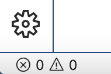
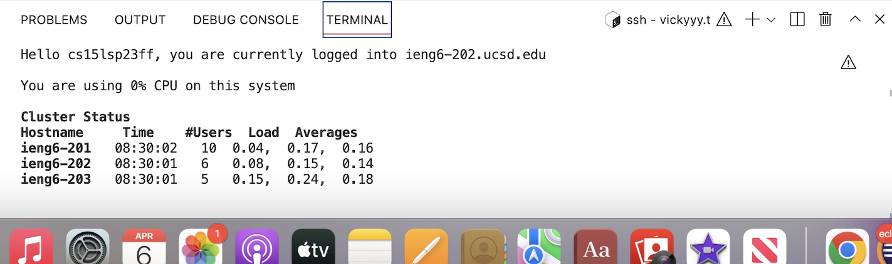

**DOWNLOADING VS CODE:**
------------------------

**STEP 1**: I used the link given in the write up to get on VS code. Here you will see the blue download button, I will go ahead and click this here.

[VSCODELINK](https://code.visualstudio.com/)

**STEP 2**: Then you are going to click whichever device you have and download from there. I had a mac so I chose mac and from there my system downloaded it. 

**STEP 3**: In the lower left of the screen you will see it downloading give it a couple of minutes and then click on it. 

**STEP 4**: From here VSCODE will open. You have now downloaded VS code on to your system. You will be able to open through launchpad if you have a mac. **HAPPY CODING**

**REMOTELY CONNECTING:**
------------------------

**STEP 1**: In VS Code, look in the lower left corner and click the icons below; from there you will see a heading Terminal. Click that and the terminal will open

**STEP 2**: Now we are going to use ssh in the terminal. In order to do so put the following code in the terminal and hit return on keyboard. Replace the zz with your personal username. NOTE- you do not need to use the $ in front as that is just to show it is a command. 

`$ ssh cs15lsp23zz@ieng6.ucsd.edu`

**STEP 3**: Once you have run that command you should get the following below:

`ssh cs15lsp23zz@ieng6.ucsd.edu
The authenticity of host 'ieng6.ucsd.edu (128.54.70.227)' can't be established.
RSA key fingerprint is SHA256:ksruYwhnYH+sySHnHAtLUHngrPEyZTDl/1x99wUQcec.
Are you sure you want to continue connecting (yes/no/[fingerprint])?`

 If you have the following type yes and hit return. If you are not seeing this, please raise your hand and get a tutor.
 
 **STEP 4**: It will ask for you to input your password, when typing it wont show that your typing but know that is gathering what you are writing.
 
 `Password:`
 
 **STEP 5**: Now that you've inputted the passowrd you should see the following below after running the command:
 

If you see this **CONGRATS** you have connected to a remote server. If you do not see this, please raise your hand and wait for a tutor to arrive.

**TRYING SOME COMMANDS:**

**STEP 1**: Here we are going to run some commands in the terminal. Here is a list of commands we may go over and you can try on your own:

`-cd ~`

`-cd`

`-ls -lat`

`-ls -a`

`-ls <directory> where <directory> is /home/linux/ieng6/cs15lsp23/cs15lsp23abc, where the abc is one of the other group members’ username`

`-cp /home/linux/ieng6/cs15lsp23/public/hello.txt ~/`

`-cat /home/linux/ieng6/cs15lsp23/public/hello.txt`

**STEP 2**: From here you are going to write the following commands in the terminal and look at the results.

**WE WILL RUN**
`-cd ~`

`-cd`

`-ls -lat`

`-ls -a`

**REULT**

cd is essentially change directory which is why for both when I ran it nothing appeared becuase I was already in the one directory available. Following cd, we have ls which essentially lists the contents in the file or folder you are currently working in. 

**NEXT WE WILL RUN**

`-ls <directory> where <directory> is /home/linux/ieng6/cs15lsp23/cs15lsp23abc, where the abc is one of the other group members’ username`

`-cp /home/linux/ieng6/cs15lsp23/public/hello.txt ~/`

`-cat /home/linux/ieng6/cs15lsp23/public/hello.txt`

**RESULT**

I was not able to gain access to a classmates directory and list it, however I was able to run both the cp and cat. The cp returned nothing as it is just a copy, and the cat concatenated the files which printed 'Hello'

**STEP 3**: In additon to the ones above also try using cd, ls, pwd, mkdir, and cp! When running these see how they react and what the output is, or if there are erros think about why there are errors. Here is an example of what is should look like below:

 **Overall, make sure you have a general understanding of all the material. For example: CD is change in directory and when we put the ~ after it it cancels the before action. ls lists the contents in our directory/file. PWD is are parent working directory. mkdir makes a new working directory. Lastly cp is simply copy. Things like this will help you go far in the class. Enjoy the rest of spring quarter in CSE15L :))**
