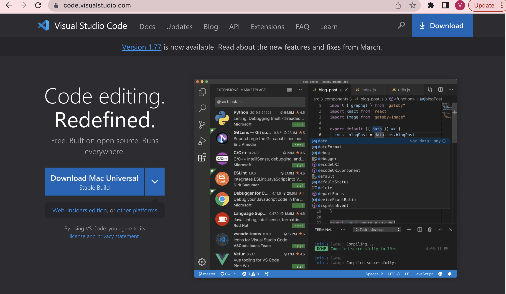
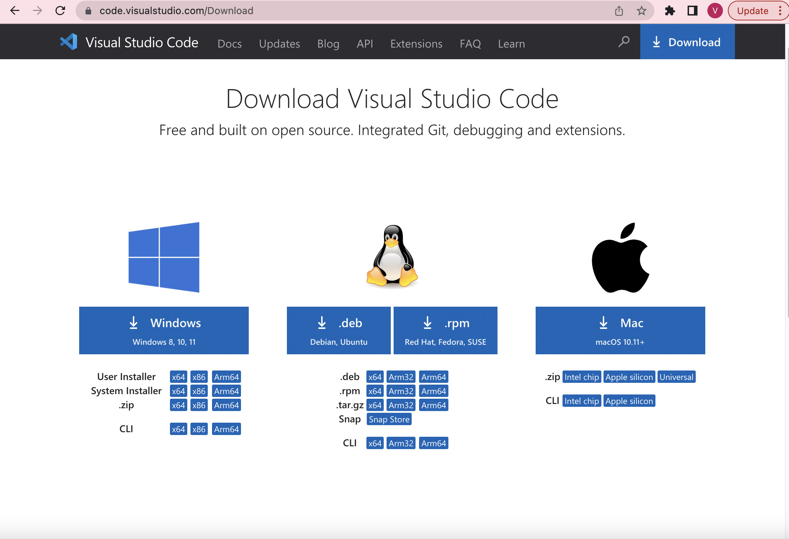
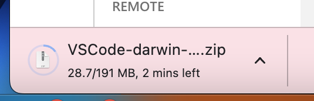
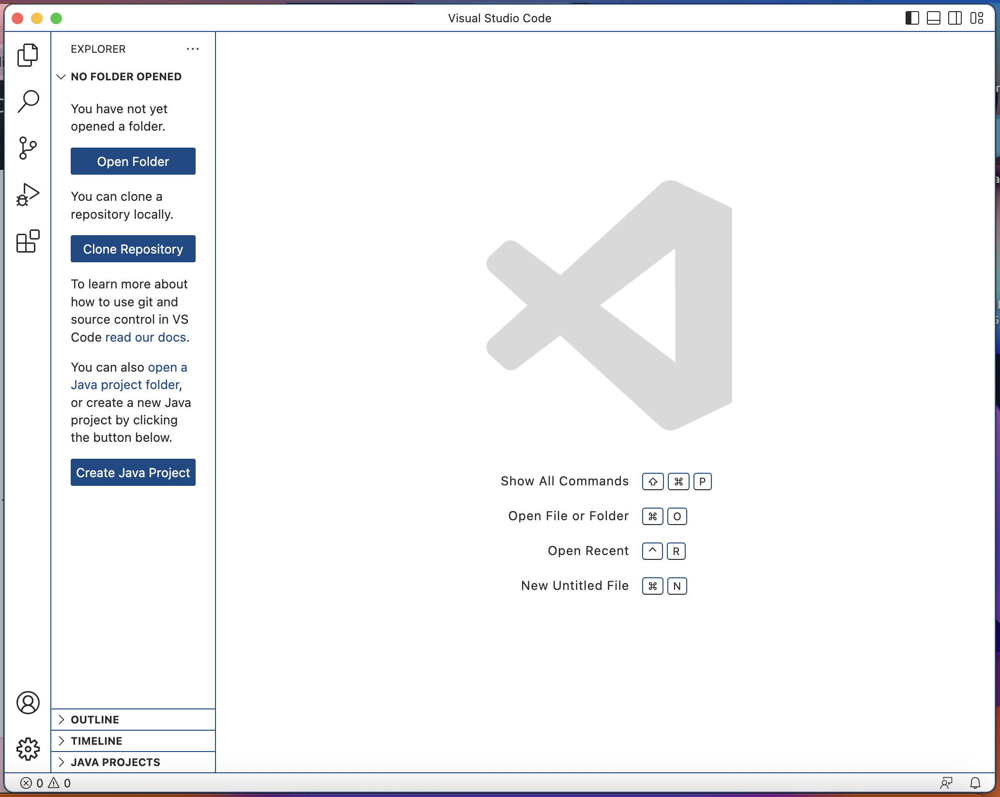

**#DOWNLOADING VS CODE

**STEP 1**: I used the link given in the write up to get on VS code. Here you will see the blue download button, I will go ahead and click this here. 

**STEP 2**: Then you are going to click whichever device you have and download from there. I had a mac so I chose mac and from there my system downloaded it. 

**STEP 3**: In the lower left of the screen you will see it downloading give it a couple of minutes and then click on it. 

**STEP 4**: From here VSCODE will open. You have now downloaded VS code on to your system. You will be able to open through launchpad if you have a mac. **HAPPY CODING**

