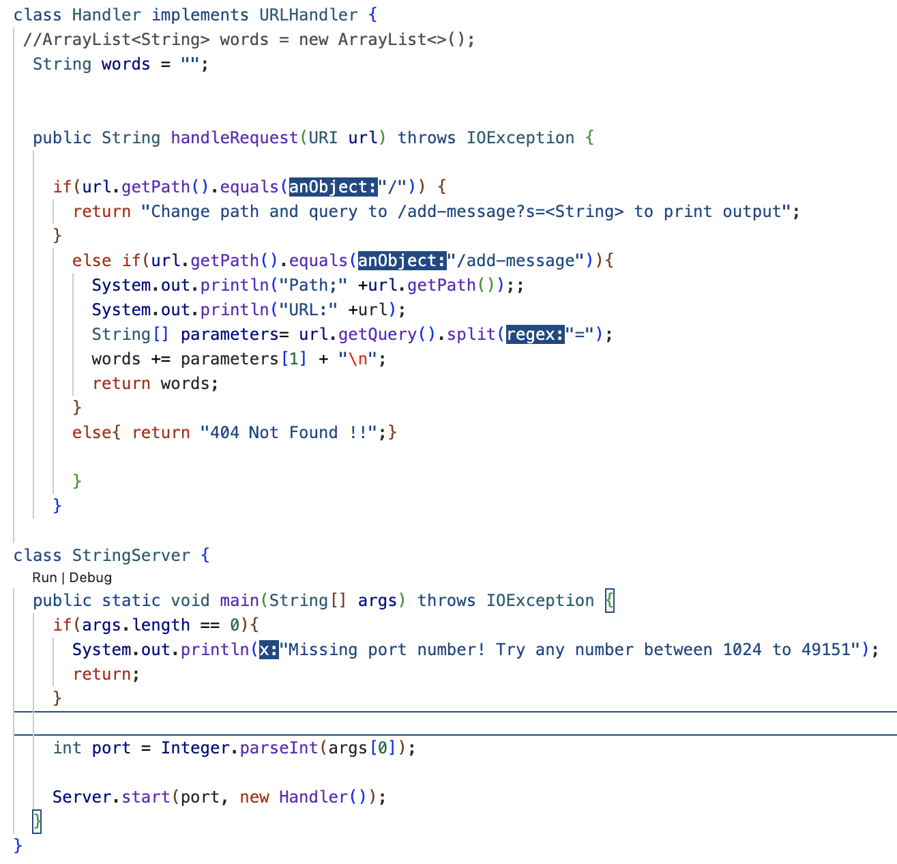
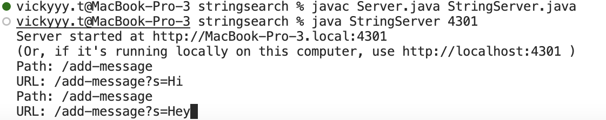
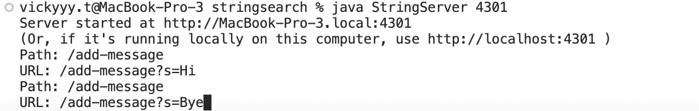
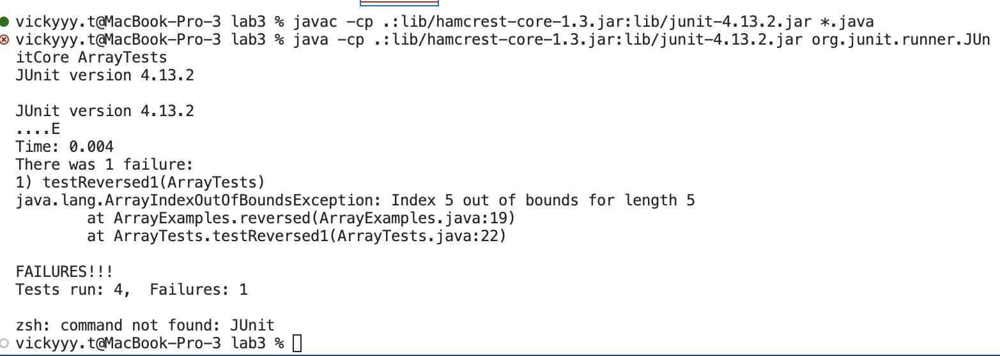

**CODE FOR STRING SERVER:**
------------------------

**Purpose for code:** The purpose of this code is to return the string after the equal sign and then return a new line of the following string inputted in the localhost of our choice.

**Methods Called:**
 The `Server.start(port, new Handler());` in StringServer.java will call the main method in Server.java which calls `handleRequest()`. This is in StringServer.java and also contains the interface called `URLHandler`. The URI named URL is passed through, then in the Handler method there are lines that use getPath and getQuery. Additonally, there is a split() method to split the query by an equal sign and will create the array called parameters.

`$ javac Server.java StringServer.java`

`$ java StringServer 4301`

**Relevant arguments and Relevant fields of the class:**
`Server.start(port, new Handler());` takes in a int and a URLHandler type. The port can be any int between 1024 and 49151. Port essentially is the int you choose your localhost to be on. HandleRequest has an argument of URI which is named url as said before. Url is the `"\add-message?s=Hi"` part in the terminal. This will always be a string type hence the `"s"` after the question mark.

**Values of relevant fields changing from specific request**

The value of `parmater[1]` is what chnage din the code, this is what gets printed into the code. The string `words` follows if the user changes the `query` and `parameter[1]` and will be stored into `words`. From this the changes will be printed on the server.

**BUG AND BUG FREE METHODS:**
-----------------------------

**test that prodcues an error with buggy code:**

this produces an error because it does not return it in a reverse order but instead it would return only certain elements reversed and not the whole array

`@Test`

`public void testReversed(){`

 `int[] input1 = {3,2,1,0,-1};`
 
 `assertArrayEquals(new int[]{-1,0,1,2,3}, ArrayExamples.reversed(input1));}`

**test that does not prodcues an error with buggy code**

this does not give us an error because it is an empty string so regardless it will return empty

`@Test`

`public void testReversed() {`

`int[] input1 = { };`
   
`assertArrayEquals(new int[]{ }, ArrayExamples.reversed(input1));`

`}`

**output with failing test and passing test**

**CODE BEFORE THE BUG FIX**

`static int[] reversed(int[] arr) {`

`int[] newArray = new int[arr.length];`
    
`for(int i = 0; i < arr.length; i += 1)`
    
`arr[i] = newArray[arr.length - i - 1]};`
     
`return arr;`
  
 `}`

**CODE AFTER THE BUG**

`static int[] reversed(int[] arr) {`

`int[] newArray = new int[arr.length];`
    
`for(int i = 0; i < arr.length; i += 1) {`
  
`newArray[i] = arr[arr.length]-i-1;}`
   
`return NewArray;}`
   
this method updated the original which lost date as it updated without a temp. As this method has a new array, the original array should not be changed so as not to lose information. It was also returning the original array. 

**PREVIEW ON WHAT I HAVE LEARNED:**
-----------------------------------

These past weeks I have learned that testing is crucial in making sure that the code written does exactly as it is supposed to. As we learned the same bug can cause multiple symptoms, and without looking at the code we have and testing it, it is impossible to know how we can approach to fix it. I also learned more about Junit and how I can test with AssertEquals. To test you would need to write AsserEquals(expected,actual). Overall I am very satisifies with what I have learned. 
 

