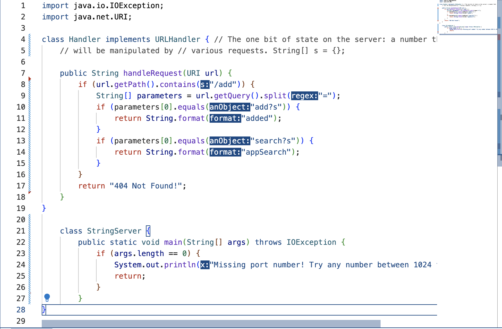
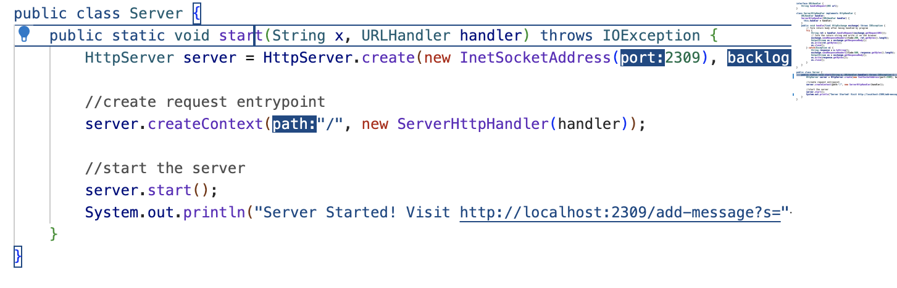
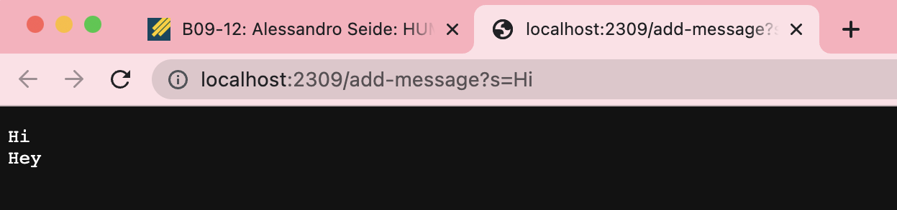

**CODE FOR STRING SERVER:**
------------------------

**Methods Called:**
 The StringServer code was changed from the NumberServer code only by adding Strings and taking Strings as an argument. The server code was similar but all I did was replace port with. The method called is my String Server method which in the terminal I would run.

`$ javac Server.java StringServer.java`

`$ java StringServer`

**Relevant arguments and Relevant fields of the class:**
Relevant arguments that are of significance are URI url handler, without this we would not be able to get the overall url that holds the local host we are trying to acess. As for the fields of the class, I am implementing handler which essentially contains preexistine written implementation methods.

**Values of relevant fields changing from specific request**

The port values and the String value are interchagable as you are able to create a new port and are able to implement a new String to continously add on. The https portion of the code was changed.

`System.out.println("Server Started! Visit http://localhost:"+port+"/add-message?s="+x+"");`

**BUG AND BUG FREE METHODS:**
-----------------------------

**test that prodcues an error with buggy code:**

this produces an error because it does not return it in a reverse order but instead it would return only certain elements reversed and not the whole array

`@Test`

`public void testReversed1() {`

  `int[] input1 = { 3,2,1,0,-1};`
 
 ` assertArrayEquals(new int[]{-1,0,1,2,3 }, ArrayExamples.reversed(input1));`
`}`

**test that does not prodcues an error with buggy code**

this does not give us an error because it is an empty string so regardless it will return empty

` @Test`

`  public void testReversed() {`

   ` int[] input1 = { };`
   
   ` assertArrayEquals(new int[]{ }, ArrayExamples.reversed(input1));`
 ` }`

**output with failing test and passing test**

**CODE BEFORE THE BUG FIX**

**CODE AFTER THE BUG**
`
static int[] reversed(int[] arr) {

    int[] newArray = new int[arr.length];
    
    for(int i = 0; i < arr.length; i += 1) {
    
      newArray[i] = arr[arr.length]-i-1;
      
    }
    
    return newArray;
  }

`

