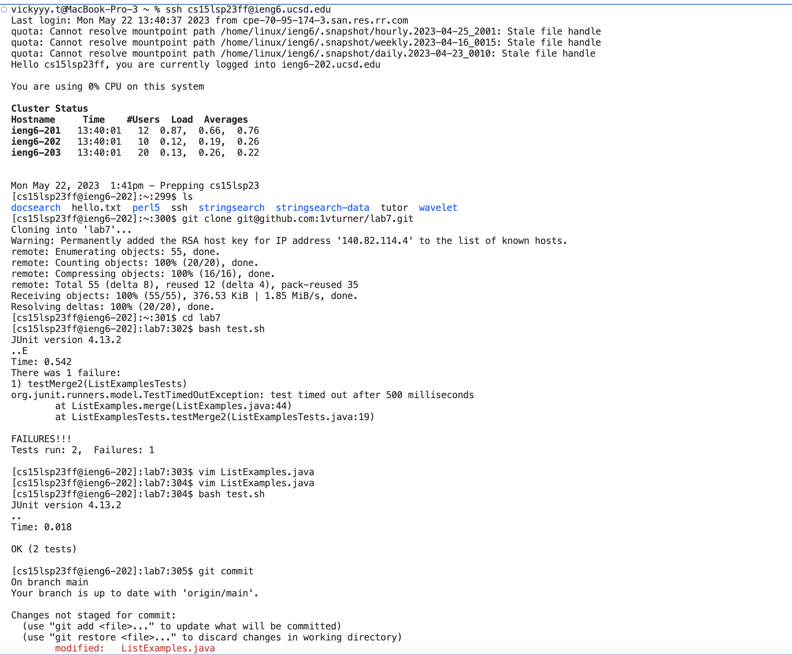
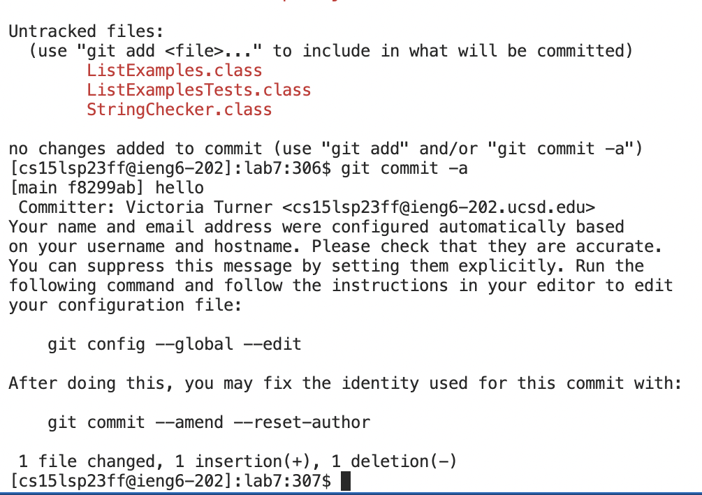

# Screenshot of Terminal and Directions



**Keys pressed for ssh account:**
-----------------
```
<up><up><up>
```
Went up three times because when practicing this before it was saved in my search history. No password was needed and it loaded up my cse15l account. 


**Keys pressed for ls:**
-----------------
```
ls
```
I physcially typed ls because it was not anywhere within 5 `<up>` arrows. From here it named all the files in my ssh account, I did this to ensure I deleted lab7 repository correctly.

**Keys pressed for cloning:**
-----------------
I typed `git clone`, then went to my repository and used my ssh that I have on my github account and clicked
```
<ctrl +v>
```
which lead me to have `git clone git@github.com:1vturner/lab7.git`

**Keys Pressed for running the test on ListsExamplesTest.java:**
-----------------
```
<up><up><up><up><up><up><up>
```
I hit the up arrow seven times because I had done this in the previous example when I practiced the steps beforehand
which lead me to have `bash test.sh` Which ran two tests but failed one of the tests


**Keys pressed for using vim and passing the tests:**
-----------------
```
vim ListExamples.java 
<k><k><k><k>
<i>
```
I inserted a 2 where index1 was

```
<esc>
<wq:>
```
Once I exited vim I used `wq:` to save the file so the following test would Pass.

`<up> <up>` 

I clicked the up arrow twice to rerun `bash test.sh` and both the tests ran and both passed. 





